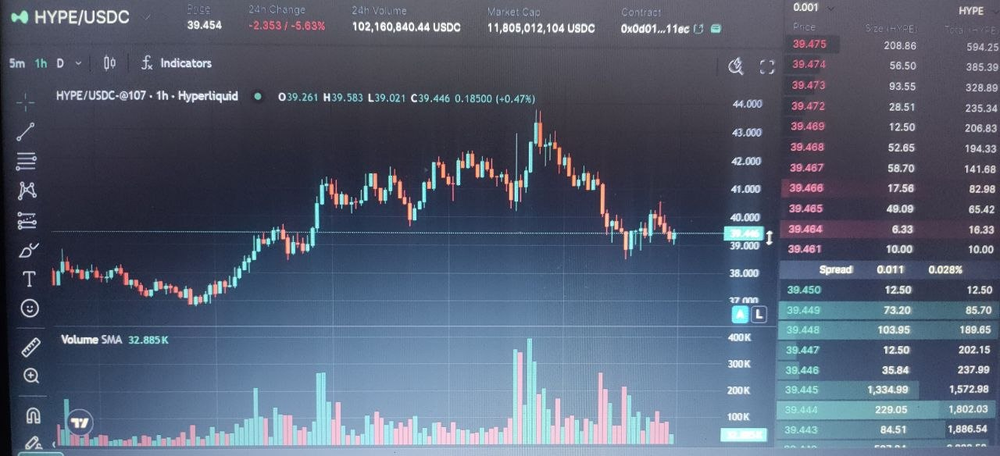

# 🤖 Hyperliquid Trading Bot

**AI-Powered Trading Bot for Hyperliquid Exchange**  
*Powered by Claude Opus 4.6 via OpenRouter • All data from Hyperliquid API • Real-time React Dashboard*

[](frontend/src/assets/dashboard-reference.jpg)

## 🚀 Quick Start (5 minutes)

### 1. Install Dependencies
```bash
pip install -r requirements.txt
cd frontend && npm install && cd ..
```

### 2. Setup Environment
```bash
cp .env.example .env
```
**IMPORTANT**: Edit `.env` and **fill these REQUIRED fields**:
```
HYPERLIQUID_WALLET_ADDRESS=0xYourWalletAddress
HYPERLIQUID_PRIVATE_KEY=0xYourPrivateKey
OPENROUTER_API_KEY=sk-or-...
DASHBOARD_API_KEY=your-super-secret-key-change-this-now
```

### 3. Test Everything
```bash
python scripts/test_connection.py
```
✅ **All green?** Continue!

### 4. Test Single Cycle (SAFE - Paper Mode)
```bash
python hyperliquid_bot_executable_orders.py --single-cycle
```

### 5. Production Launch (3 Terminals)
**Terminal 1 - Bot:**
```bash
python hyperliquid_bot_executable_orders.py
```

**Terminal 2 - API Server:**
```bash
python api_server.py
```

**Terminal 3 - Dashboard:**
```bash
cd frontend && npm run dev
```

✅ **Dashboard**: [http://localhost:3000](http://localhost:3000)

## 🔧 Fix Common Issues

### ❌ "DASHBOARD_API_KEY not set while EXECUTION_MODE=live"
**Problem**: Backend requires API key in LIVE mode, frontend doesn't send it.

**Solution**:
1. `.env` deve avere:
   ```
   DASHBOARD_API_KEY=your-super-secret-key-change-this-now
   ```
2. **Riavvia** `api_server.py`
3. **Riavvia** frontend (`npm run dev`)
4. Vite carica automaticamente `VITE_DASHBOARD_API_KEY` dal `.env`

**Test**: 
```bash
curl -H "X-API-Key: your-super-secret-key-change-this-now" http://127.0.0.1:5000/api/health
```
✅ Response: `{"status":"ok"}`

### ❌ Dashboard "API Server Not Running"
```
Terminal 2: python api_server.py
```
✅ Deve mostrare: `Running on http://127.0.0.1:5000`

### ❌ "Unauthorized" (401)
- Verifica `DASHBOARD_API_KEY` identico in `.env`
- Riavvia **entrambi** server (backend + frontend)
- Controlla browser console per errori CORS

### ❌ No trades
```
# Testa in paper mode prima
EXECUTION_MODE=paper python hyperliquid_bot_executable_orders.py --single-cycle

# Per live trading REALE:
EXECUTION_MODE=live
ENABLE_MAINNET_TRADING=true
```

## 📊 Dashboard Features

| Section | Cosa vedi |
|---------|-----------|
| **Stats** | Balance, PnL, Margin, Win Rate, Cycle |
| **Drawdown** | Barra rossa se >8% (blocca trading a 12%) |
| **TradingView** | Candele live + Order Book |
| **Equity** | Curva equity reale (non simulata) |
| **Risk Mgmt** | SL/TP/Trailing/Break-Even attivi |
| **Trades** | Storia + ragionamento AI + Export CSV |
| **Circuit Breakers** | Protezione API failures |
| **Logs** | Log live filtrati |

## ⚙️ Configuration (.env)

### Required (Obbligatorie)
```
HYPERLIQUID_WALLET_ADDRESS=0x...
HYPERLIQUID_PRIVATE_KEY=0x...
OPENROUTER_API_KEY=sk-or-...
DASHBOARD_API_KEY=your-secret-key
```

### Trading Mode
```
EXECUTION_MODE=paper     # Simulato (sicuro)
EXECUTION_MODE=live      # Ordini reali (richiede DASHBOARD_API_KEY)
ENABLE_MAINNET_TRADING=true  # ⚠️ SOLDI VERTI!
```

### Risk Limits
```
MAX_DRAWDOWN_PCT=0.12    # Stop at 12%
DAILY_NOTIONAL_LIMIT_USD=500
HARD_MAX_LEVERAGE=7
```

### Risk:Reward
```
DEFAULT_SL_PCT=0.03      # Stop Loss 3%
DEFAULT_TP_PCT=0.05      # Take Profit 5%
```

**Full config**: `.env.example`

## 🛡️ Safety Features (Attive Sempre)

- **Paper Mode** (default): Ordini simulati
- **Drawdown Protection**: Blocca a 12%
- **Circuit Breakers**: API down → stop
- **Emergency Close**: Margin >85%
- **Correlation Block**: No double BTC+ETH long
- **Fill Verification**: Conferma ordini eseguiti

## 📱 Telegram (Opzionale)
```
TELEGRAM_BOT_TOKEN=123456:ABC...
TELEGRAM_CHAT_ID=123456789
```
Notifiche: trades, SL/TP, emergenze, daily summary.

## 🧪 Scripts Utili

```bash
# Test completo
python scripts/test_connection.py

# Chiudi SOL (emergenza)
python close_sol_position.py

# Ordine minimo test
python hyperliquid_minimal_order.py

# Controlla posizioni
python check_current_positions.py
```

## 🏃‍♂️ Gestione Bot (Production)

### Avvio Completo
```bash
# Bot (background)
nohup python hyperliquid_bot_executable_orders.py > bot.log 2>&1 &

# API Server
python api_server.py

# Dashboard
cd frontend && npm run dev
```

### Stop Graceful
```bash
# Ctrl+C su tutti i terminali
# O kill -SIGTERM <pid>
```

### Monitoraggio
```
tail -f logs/hyperliquid_bot.log
curl http://127.0.0.1:5000/metrics  # Prometheus
```

### Restart Veloce
```bash
# Script pronti
bash scripts/start_bot.sh
bash scripts/run_single_cycle.sh
```

## 🚀 Docker (Facoltativo)
```bash
docker-compose up -d
docker-compose logs -f bot
```

## 🐛 Troubleshooting Rapido

| Errore | Soluzione |
|--------|-----------|
| **DASHBOARD_API_KEY missing** | Aggiungi in `.env`, riavvia tutto |
| **Dashboard blank** | `python api_server.py` |
| **401 Unauthorized** | Verifica chiave identica backend/frontend |
| **No trades** | `EXECUTION_MODE=live ENABLE_MAINNET_TRADING=true` |
| **Permission denied** | `chmod 700 state/ logs/` |

## 📈 Performance & Costi

| Item | Costo |
|------|-------|
| LLM (Opus) | ~$0.03/call → ~$10/giorno (20 pairs, 2min cycle) |
| Hyperliquid | Gratuito (maker/taker fees normali) |

**Scalabile**: Aumenta `DEFAULT_CYCLE_SEC` per ridurre costi LLM.

## 📄 License
MIT — Free for personal/commercial use.

**Buon Trading! 🚀🇮🇹**